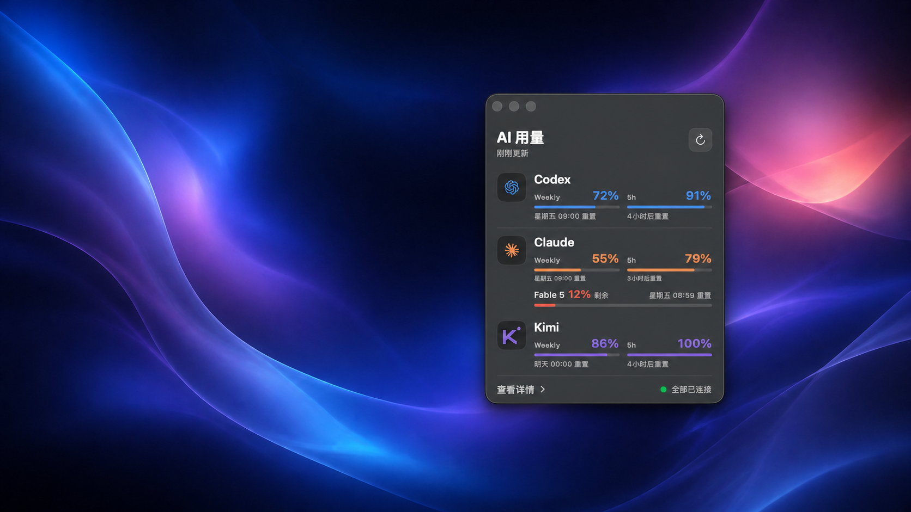
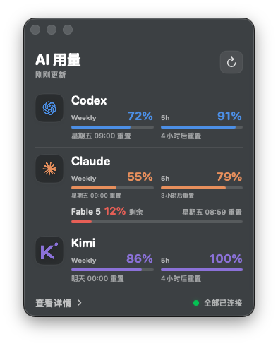
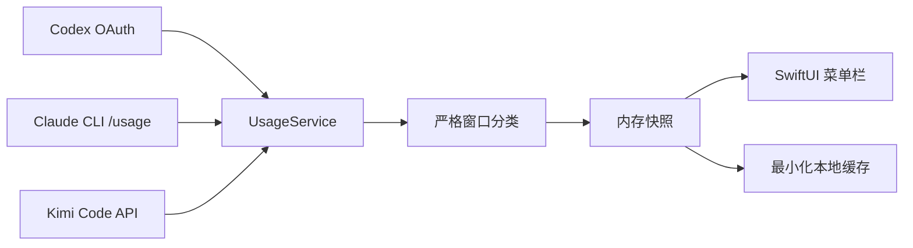

<p align="center">
  
</p>

<h1 align="center">AI Usage Menu</h1>

<p align="center">
  一款轻量、原生、尊重隐私的 macOS 菜单栏用量面板。<br>
  在一个真实毛玻璃窗口里查看 Codex、Claude、Kimi 与 Claude Fable 5 的剩余额度。
</p>

<p align="center">
  <a href="https://github.com/cloveric/ai-usage-menu/actions/workflows/ci.yml"></a>
  <a href="https://github.com/cloveric/ai-usage-menu/releases/latest"></a>
  
  
  <a href="LICENSE"></a>
</p>

<p align="center">
  <a href="#安装">安装</a> ·
  <a href="#支持的额度">支持的额度</a> ·
  <a href="#隐私设计">隐私设计</a> ·
  <a href="#从源码构建">从源码构建</a> ·
  <a href="CONTRIBUTING.md">参与贡献</a>
</p>

> [!NOTE]
> 顶部展示图使用合成背景和演示数据，不包含维护者的桌面、账号或真实用量信息。

## 特点

| 原生而轻量 | 数据不乱猜 | 隐私优先 |
|---|---|---|
| SwiftUI + AppKit，真实 `NSVisualEffectView` 毛玻璃；不运行本地 Web 服务。 | 按窗口真实时长识别 Weekly 与 5h；不会把月度额度或 Weekly 冒充 5h。 | 凭据只在内存中用于请求官方用量接口；不写入应用缓存、不上传到项目服务器。 |

- 菜单栏直接显示三家主额度的平均剩余量，例如 `AI 71%`
- Codex、Claude、Kimi 的 Weekly、5h、进度与重置时间
- Claude Fable 5 独立额度
- Codex/Kimi 每 15 分钟自动刷新；Claude CLI 最多每 30 分钟启动一次，手动刷新可立即更新
- 网络故障时只保留一小时内的有时效缓存；过期数据不会继续伪装成实时值
- Kimi 短期令牌过期时，仅临时调用官方 CLI 完成刷新，读取 API 后立即退出
- 普通窗口与菜单弹窗均使用 macOS 系统材质，而不是半透明渐变伪装
- 无 Dock 图标、无广告、无遥测、无账号系统

<p align="center">
  
  <br>
  <sub>演示数据 · 原生 macOS 深色玻璃界面</sub>
</p>

## 支持的额度

| Provider | Weekly | 5h | 额外额度 | 首选数据源 |
|---|:---:|:---:|:---:|---|
| Codex | ✓ | 上游提供时显示 | Codex Spark 诊断 | ChatGPT OAuth usage API |
| Claude | ✓ | ✓ | Fable 5 | 官方 Claude CLI `/usage` |
| Kimi | ✓ | ✓ | — | Kimi Code usage API |

Codex 有时只返回 `10080` 分钟 Weekly 窗口而不返回 `300` 分钟 5h 窗口。此时应用会明确显示“服务端暂未返回”，并保留正确的 Weekly 数据；不会用旧值推算当前 5h。

AI 用量不再直接读取 `Claude Code-credentials` 钥匙串项目。Claude 额度由已经登录的官方 `claude` CLI 查询，因此凭据仍由 Claude Code 自己管理，应用只接收 `/usage` 返回的额度数字。若出现声称“AI 用量”要读取该项目的密码框，请直接拒绝并报告；当前实现不会主动发起这种访问。

## 安装

### 下载预编译版本

1. 前往 [Releases](https://github.com/cloveric/ai-usage-menu/releases/latest)。
2. 下载 `AI-Usage-Menu-v0.1.1-macOS-arm64.zip` 并解压。
3. 将 `AI 用量.app` 移入“应用程序”。
4. 首次启动若 macOS 提示开发者未验证，请在 Finder 中右键应用并选择“打开”。

当前预编译版本面向 Apple silicon。Intel Mac 用户可以尝试从源码构建。

### 使用前准备

请先在本机分别完成所需服务的登录：

```bash
codex login
claude
kimi
```

应用复用这些工具已有的本地登录态，不要求在应用内再次输入令牌。

## 隐私设计

- 不包含分析 SDK、广告 SDK、崩溃上报或自建服务器
- 不把 OAuth token、API key、Cookie 或对话内容写入应用缓存
- 本地缓存仅保存百分比、重置时间、来源、连接状态与更新时间
- 超过一小时的旧缓存不会作为当前额度继续展示
- 应用不直接读取 Claude Code 钥匙串，也不会索要、接收或保存 macOS 登录密码
- Codex 实时请求失败时，只解析最近一小时会话文件中的数字 `rate_limits` 对象；不会解码或输出对话正文
- 诊断命令默认输出经过约束的额度元数据，不输出凭据

完整说明见 [PRIVACY.md](PRIVACY.md)。报告安全问题请阅读 [SECURITY.md](SECURITY.md)，不要在公开 Issue 中粘贴令牌或完整日志。

## 资源占用

在维护者的 Apple silicon Mac 上，长期运行并完成多次自动刷新后，主程序物理内存通常约为 **18–32 MB**，空闲时没有常驻子进程。不同系统版本、账户状态和 Swift 运行时可能产生差异。

Claude Code CLI 本身较重：实测 `/usage` 查询会短暂占用约 **200–325 MB** 物理内存，通常十几秒后退出。为控制资源，后台最多每 30 分钟启动一次；点击刷新按钮时可立即更新。它不会常驻，也不会每 15 分钟重复启动。

Kimi 凭据需要刷新时会短暂启动官方 `kimi` 进程，刷新结束即终止；它不是常驻后台服务。

## 从源码构建

要求：

- macOS 14 或更高版本
- Swift 6.2 或更高版本
- 已安装 Command Line Tools

```bash
git clone https://github.com/cloveric/ai-usage-menu.git
cd ai-usage-menu
swift run -c release CoreChecks
./scripts/build-app.sh
open "dist/AI 用量.app"
```

构建脚本会生成并进行 ad-hoc 签名。项目没有 Apple Developer ID，因此公开 Release 尚未经过 Apple 公证。

## 诊断

获取不含令牌的聚合结果：

```bash
./scripts/run-probe.sh
```

只检查单个数据源：

```bash
swift run UsageProbe --codex-oauth
swift run UsageProbe --raw-codex
swift run UsageProbe --codex-local
swift run UsageProbe --claude-cli
swift run UsageProbe --kimi-api
```

发布 Issue 前请删除账号标识、用户名路径和任何你不确定是否敏感的字段。

## 架构

应用将三条读取链路并发执行，并把 UI 与凭据读取隔离。详细说明见 [docs/ARCHITECTURE.md](docs/ARCHITECTURE.md)。



## 贡献与许可

欢迎提交 Issue 和 Pull Request。请先阅读 [CONTRIBUTING.md](CONTRIBUTING.md)。

本项目使用 [MIT License](LICENSE)。底层额度读取与 PTY 兼容逻辑复用了 MIT 许可的 [CodexBarCore](https://github.com/steipete/CodexBar)，详情见 [THIRD_PARTY_NOTICES.md](THIRD_PARTY_NOTICES.md)。Codex、Claude 与 Kimi 名称及标志属于各自权利人；本项目与相关服务商没有隶属或背书关系。

<details>
<summary><strong>English overview</strong></summary>

AI Usage Menu is a privacy-conscious native macOS menu bar utility for monitoring Codex, Claude, Kimi, and Claude Fable 5 quota windows. It uses system vibrancy, classifies quota windows by their reported duration, stores no credentials, and does not fabricate a missing 5-hour value. The current prebuilt release targets Apple silicon and requires macOS 14 or later.

</details>
